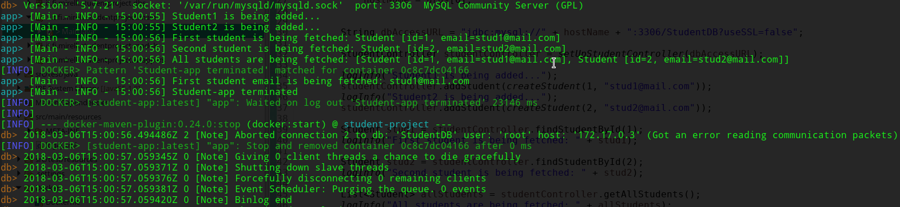

# APT project AY 17-18 
[](https://travis-ci.org/MMirelli/atswd-project) [](https://coveralls.io/github/MMirelli/atswd-project?branch=master) [](https://sonarcloud.io/dashboard?id=it.fi.mirelli%3Astudent-project)

##  Introduction

This project is thought to be a small and simplified demonstration of the power of JPA and Hibernate technologies.   It offers an easy  interface to communicate with SQL  DBs, implementing the MVC pattern. The final jar file, produced by the following building instructions, gives evidence of the application correct behaviour in persisting and fetching data to and from a MySQL database image, running on a Docker container, as an end-to-end integration test. 

##  Building

###	Requirements

Here is what you need to successfully build the project, we assume your OS is a Linux Derivate:

- The latest version of [docker-ce](https://docs.docker.com/install/linux/docker-ce/ubuntu/);

- The latest maven version:

	```
	$ sudo apt-get install maven
	``` 
	
- The latest git version git:

	```	
	$ sudo apt-get install git
	```

- JDK 8 (we remember to set JAVA_HOME so as to it references your JDK installation folder) ; 


### Step by step instructions

	 
1. Activate the docker daemon:

	```	
	$ sudo systemctl start docker
	``` 


2. Clone our repository:
	
	```	
	$ git clone https://github.com/MMirelli/atswd-project.git
	``` 
	
3. Move to the folder `atwsd-project/student-project` and just run (you may need su permissions due to docker daemon):

	```	
	$ cd atwsd-project/student-project && sudo ./run.sh
	``` 
## What does `run.sh` do?

The script simply starts a maven build: it executes the maven `clean` lifecycle and `default` until the `verify` phase, using the `docker-compose-runner` maven profile. This builds the jar of the application, with all its dependencies, and starts the `docker-compose.yml`. In conclusion this file will execute the `student-project/Docker/Dockerfile` generating and linking the `student-app` image to the MySQL docker image, running on different docker container.
At the end of the build this is the expected behaviour:	




